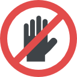

  
  <h2>Google Meet Hand-icap</h2>
  
This is a simple Chrome extension that disables the "hands up" button in popular Google Meets.

  
  
  
  

 

## About extension

With this extension, you no longer have to worry about accidentally clicking the "hands up" button during a meeting

This extension is free and open-source, and contributions are welcome. If you have any issues or suggestions, feel free to open an issue on the Github repository.</>

## Available in

## Contributing

Even though is a plugin with a short lifetime, feel free to contribute adding new issues or PR.
